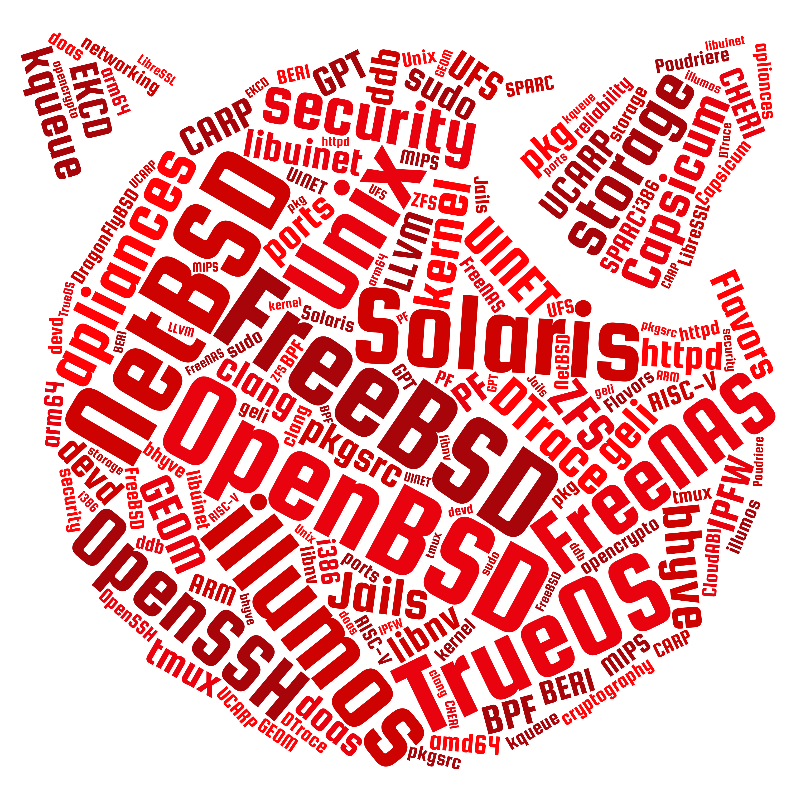

<h1>About us</h1>

Our group was created to promote systems from the BSD family. We organize meetings that bring together lovers of Unix systems. At the meetings, we conduct presentations and open discussions on topics related to operating systems. It is important to us that the events we organize are compeling for anyone interested in the subject of operating systems and security. Everyone can suggest the subject of presentations and discussions. We are happy to hear from anyone who wants to talk about any chosen issue not strictly related to operating systems.

<h1>Our upcoming meeting</h1>

When:
<pre>
October 11, 2018
18:15 - 21:15
</pre>
Where:
<pre>
Warsaw University of Technology
Faculty of Electrical Engineering

ul. Koszykowa 75
Warsaw
</pre>
What:
<pre style="white-space: pre-wrap;">
BSD-PL 0.5. Usergroup Half-birthday.
Krzysztof Szczepański

A Brief History of Time in FreeBSD.
Miłosz Kaniewski

What are containers anyway?
Maciej Pasternacki
</pre>

<a href="https://bit.ly/bsd-pl-6">Click to register</a>

See you there!

